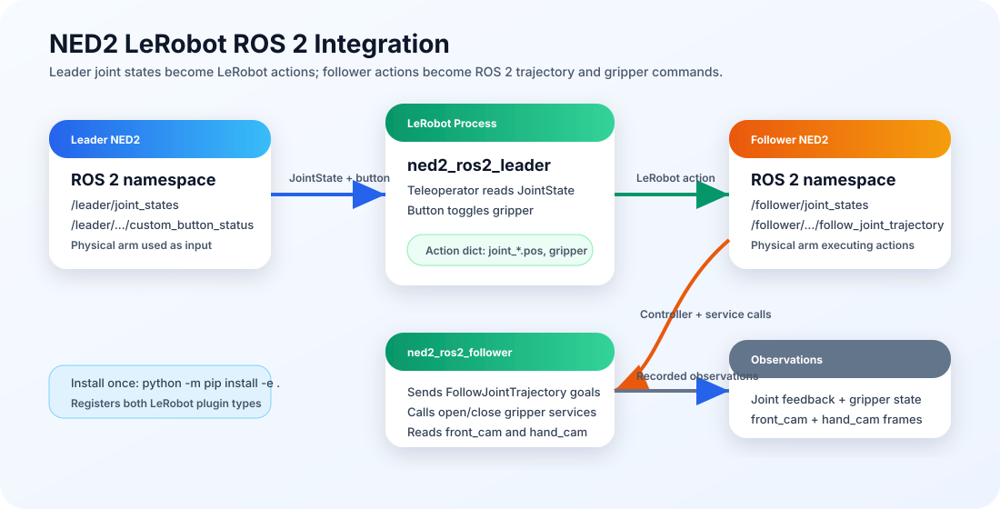

# NED2 LeRobot Integration

ROS 2 bridge plugins that let [LeRobot][lerobot] use two [Niryo NED2][niryo-ned2] arms as a leader/follower teleoperation and dataset-recording system.

This workspace installs one editable Python distribution, `lerobot_robot_ned2_ros2`, which contains two LeRobot plugin packages:

- `lerobot_robot_ned2_ros2`: follower-side `Robot` implementation.
- `lerobot_teleoperator_ned2_ros2`: leader-side `Teleoperator` implementation.

The follower package imports the teleoperator package during plugin discovery, so installing this repository once registers both LeRobot types.

<p align="center">
  
</p>

## Contents

- [Workspace Layout](#workspace-layout)
- [How It Works](#how-it-works)
- [Requirements](#requirements)
- [Installation](#installation)
- [Quick Start](#quick-start)
- [Recording Datasets](#recording-datasets)
- [Configuration Reference](#configuration-reference)
- [Camera Setup](#camera-setup)
- [Troubleshooting](#troubleshooting)
- [Visual Assets](#visual-assets)
- [Useful References](#useful-references)
- [License](#license)

## Workspace Layout

```text
NED2_LeRobot_Integration/
├── README.md
├── pyproject.toml
├── ned2.urdf
├── docs/
│   └── images/
│       └── ned2_lerobot_architecture.svg
├── src/
│   ├── lerobot_robot_ned2_ros2/
│   │   ├── config_ned2_ros2_follower.py
│   │   └── ned2_ros2_follower.py
│   └── lerobot_teleoperator_ned2_ros2/
│       ├── config_ned2_ros2_leader.py
│       └── ned2_ros2_leader.py
├── Test_FIles/
│   ├── Cam_Test_FLIPPED.py
│   └── LeRobot_Cam_Integration.py
└── teleop_test.log
```

Key files:

- [`pyproject.toml`](pyproject.toml) defines the editable Python distribution and packages.
- [`src/lerobot_robot_ned2_ros2/config_ned2_ros2_follower.py`](src/lerobot_robot_ned2_ros2/config_ned2_ros2_follower.py) defines the follower robot config, cameras, action server, gripper services, and observation/action schema.
- [`src/lerobot_robot_ned2_ros2/ned2_ros2_follower.py`](src/lerobot_robot_ned2_ros2/ned2_ros2_follower.py) implements the LeRobot `Robot` interface using ROS 2 topics, services, and a `FollowJointTrajectory` action client.
- [`src/lerobot_teleoperator_ned2_ros2/config_ned2_ros2_leader.py`](src/lerobot_teleoperator_ned2_ros2/config_ned2_ros2_leader.py) defines the leader teleoperator config and button-based gripper toggle.
- [`src/lerobot_teleoperator_ned2_ros2/ned2_ros2_leader.py`](src/lerobot_teleoperator_ned2_ros2/ned2_ros2_leader.py) implements the LeRobot `Teleoperator` interface from ROS 2 `JointState` messages.
- [`ned2.urdf`](ned2.urdf) records the NED2 joint/link model used by this workspace.
- [`Test_FIles/`](Test_FIles/) contains camera smoke-test scripts. The directory name is kept as it exists in the workspace.

## How It Works

The system is organized around a physical leader arm and a physical follower arm:

- The leader plugin subscribes to `/leader/joint_states` and emits a LeRobot action dictionary with `joint_1.pos` through `joint_6.pos`.
- The leader plugin can also listen to the NED2 custom end-effector button and toggle the action key `gripper` between open and closed values.
- The follower plugin subscribes to `/follower/joint_states`, reads configured cameras, and sends joint targets to the follower `FollowJointTrajectory` action server.
- The follower plugin maps `gripper` actions to the Niryo open/close gripper services.
- LeRobot commands such as `lerobot-teleoperate` and `lerobot-record` connect both plugins through their registered types.

Default LeRobot plugin types:

| Role | Type ID | Python class | Config file |
| --- | --- | --- | --- |
| Follower robot | `ned2_ros2_follower` | `NED2ROS2Follower` | [`config_ned2_ros2_follower.py`](src/lerobot_robot_ned2_ros2/config_ned2_ros2_follower.py) |
| Leader teleoperator | `ned2_ros2_leader` | `NED2ROS2Leader` | [`config_ned2_ros2_leader.py`](src/lerobot_teleoperator_ned2_ros2/config_ned2_ros2_leader.py) |

## Requirements

- Python `>=3.10`.
- [LeRobot][lerobot] installed in the active Python environment.
- [ROS 2][ros2] available in the shell where LeRobot is launched.
- `rclpy` importable from the same Python environment used by LeRobot.
- Niryo ROS 2 packages that provide `niryo_ned_ros2_interfaces`.
- Running ROS 2 drivers/controllers for the leader and follower NED2 arms.
- OpenCV-compatible cameras if using image observations or recording visual datasets.

Before running LeRobot commands, source the relevant ROS 2 and Niryo workspaces in the same shell. For example:

```bash
source /opt/ros/<ros-distro>/setup.bash
source <niryo_ros2_workspace>/install/setup.bash
```

Replace `<ros-distro>` and `<niryo_ros2_workspace>` with the values for your machine.

## Installation

Install this repository in editable mode from the workspace root:

```bash
python -m pip install -e .
```

Verify that both packages import and expose their LeRobot type names:

```bash
python - <<'PY'
from lerobot_robot_ned2_ros2 import NED2ROS2Follower
from lerobot_teleoperator_ned2_ros2 import NED2ROS2Leader

print(NED2ROS2Follower.name)
print(NED2ROS2Leader.name)
PY
```

Expected output:

```text
ned2_ros2_follower
ned2_ros2_leader
```

## Quick Start

Start the Niryo ROS 2 stack for both arms first. The default configuration expects this namespace layout:

| Arm | Default namespace | Required signal |
| --- | --- | --- |
| Leader | `/leader` | Joint states and optional end-effector button events |
| Follower | `/follower` | Joint states, trajectory action server, gripper services, and tool motor topic |

Check the ROS graph before starting LeRobot:

```bash
ros2 topic list
ros2 action list
ros2 service list
```

Run teleoperation with live data display:

```bash
lerobot-teleoperate \
  --robot.type=ned2_ros2_follower \
  --robot.namespace=/follower \
  --teleop.type=ned2_ros2_leader \
  --teleop.namespace=/leader \
  --display_data=true
```

If your ROS namespaces differ, override them in the CLI flags:

```bash
lerobot-teleoperate \
  --robot.type=ned2_ros2_follower \
  --robot.namespace=/my_follower \
  --teleop.type=ned2_ros2_leader \
  --teleop.namespace=/my_leader
```

## Recording Datasets

Record a local dataset with the default follower cameras:

```bash
lerobot-record \
  --robot.type=ned2_ros2_follower \
  --teleop.type=ned2_ros2_leader \
  --dataset.num_episodes=2 \
  --dataset.episode_time_s=15 \
  --dataset.fps=15 \
  --dataset.reset_time_s=5 \
  --dataset.repo_id=local/ned2_pick_place \
  --dataset.push_to_hub=false \
  --dataset.single_task="Pick and place with NED2"
```

To publish to the [Hugging Face Hub][hf-hub], use a real Hub namespace and set upload explicitly:

```bash
lerobot-record \
  --robot.type=ned2_ros2_follower \
  --teleop.type=ned2_ros2_leader \
  --dataset.repo_id=<user-or-org>/<dataset-name> \
  --dataset.push_to_hub=true \
  --dataset.single_task="Describe the task here"
```

Recording controls used by LeRobot:

- Right arrow ends the current phase early.
- Left arrow rerecords the current episode.
- `Esc` stops the session.

## Configuration Reference

Topic names are relative to the configured namespace unless they start with `/`.

### Leader Teleoperator

Defined in [`config_ned2_ros2_leader.py`](src/lerobot_teleoperator_ned2_ros2/config_ned2_ros2_leader.py).

| Setting | Default | Meaning |
| --- | --- | --- |
| `namespace` | `/leader` | Namespace for leader topics. |
| `joint_states_topic` | `joint_states` | Reads leader joint positions from `/leader/joint_states`. |
| `leader_button_topic` | `niryo_robot_hardware_interface/end_effector_interface/custom_button_status` | Reads NED2 end-effector button events. |
| `joint_names` | `joint_1` to `joint_6` | Joint order emitted to LeRobot. |
| `gripper_key` | `gripper` | Action key used for gripper state. |
| `enable_button_gripper` | `True` | Enables single-press gripper toggle from the leader button. |
| `startup_timeout_s` | `10.0` | Timeout while waiting for initial joint states. |

### Follower Robot

Defined in [`config_ned2_ros2_follower.py`](src/lerobot_robot_ned2_ros2/config_ned2_ros2_follower.py).

| Setting | Default | Meaning |
| --- | --- | --- |
| `namespace` | `/follower` | Namespace for follower topics, actions, and services. |
| `joint_states_topic` | `joint_states` | Reads follower joint state feedback. |
| `action_name` | `niryo_robot_follow_joint_trajectory_controller/follow_joint_trajectory` | Sends joint targets through `FollowJointTrajectory`. |
| `joint_names` | `joint_1` to `joint_6` | Joint order sent to the controller. |
| `point_time` | `0.4` | Trajectory point duration in seconds. |
| `tool_motor_topic` | `niryo_robot_hardware/tools/motor` | Reads tool motor feedback. |
| `update_tool_service` | `niryo_robot_tools_commander/update_tool` | Updates the active tool. |
| `open_gripper_service` | `niryo_robot/tools/open_gripper` | Opens the gripper. |
| `close_gripper_service` | `niryo_robot/tools/close_gripper` | Closes the gripper. |
| `tool_id` | `13` | Tool ID used in gripper service requests. |
| `startup_timeout_s` | `10.0` | Timeout while waiting for ROS resources. |

LeRobot action keys:

```text
joint_1.pos
joint_2.pos
joint_3.pos
joint_4.pos
joint_5.pos
joint_6.pos
gripper
```

Follower observation keys include the same joint and gripper keys plus the configured camera names.

## Camera Setup

The follower config currently defines two OpenCV cameras:

| Camera key | Default device path | Resolution | FPS | Rotation |
| --- | --- | --- | --- | --- |
| `front_cam` | `/dev/v4l/by-id/usb-BC-250311-ZW_USB_2.0_Camera-video-index0` | `640x480` | `30` | None |
| `hand_cam` | `/dev/v4l/by-id/usb-H264_USB_Camera_H264_USB_Camera_2020032801-video-index0` | `640x480` | `30` | `ROTATE_180` |

If the camera paths do not match your machine, list available cameras and update the `cameras` dictionary in [`config_ned2_ros2_follower.py`](src/lerobot_robot_ned2_ros2/config_ned2_ros2_follower.py):

```bash
lerobot-find-cameras opencv
```

Camera smoke tests are available in [`Test_FIles/`](Test_FIles/):

- [`LeRobot_Cam_Integration.py`](Test_FIles/LeRobot_Cam_Integration.py) checks a camera through LeRobot's OpenCV camera wrapper.
- [`Cam_Test_FLIPPED.py`](Test_FIles/Cam_Test_FLIPPED.py) checks a camera directly through OpenCV and flips the frame.

## Troubleshooting

| Symptom | Checks |
| --- | --- |
| `ned2_ros2_follower` or `ned2_ros2_leader` is not recognized | Re-run `python -m pip install -e .` in the active LeRobot environment and run the import verification command above. |
| Timed out waiting for joint states | Confirm the Niryo stack is running, namespaces match, `ROS_DOMAIN_ID` matches, and `/leader/joint_states` or `/follower/joint_states` is publishing. |
| Timed out waiting for `FollowJointTrajectory` | Confirm the follower controller exposes `/follower/niryo_robot_follow_joint_trajectory_controller/follow_joint_trajectory`. |
| Cameras fail to connect or read | Run `lerobot-find-cameras opencv`, check Linux device permissions, and update the camera paths in the follower config. |
| Gripper does not respond | Confirm the follower exposes the Niryo tool services, `tool_id=13` is correct for the attached gripper, and the leader button topic is publishing single-push events. |
| Teleoperation loop rate is unstable | Check camera bandwidth, ROS 2 network latency, CPU load, and whether `--display_data=true` is consuming extra resources. |

Historical teleoperation output is available in [`teleop_test.log`](teleop_test.log). It shows the plugin config printed by LeRobot and a successful leader/follower connection.

## Visual Assets

This README includes a generated architecture diagram at [`docs/images/ned2_lerobot_architecture.svg`](docs/images/ned2_lerobot_architecture.svg).

Suggested real images to add later:

- `docs/images/hardware-layout.jpg`: a photo showing the leader arm, follower arm, cameras, and workstation.
- `docs/images/front-and-hand-cameras.png`: a side-by-side capture from `front_cam` and `hand_cam`.
- `docs/images/rerun-teleop.png`: a screenshot of LeRobot/Rerun visualization during `lerobot-teleoperate` or `lerobot-record`.
- `docs/images/ros-graph.png`: an `rqt_graph` screenshot showing the leader and follower namespaces.

## Useful References

- [LeRobot GitHub repository][lerobot]
- [ROS 2 documentation][ros2]
- [Niryo NED2 product page][niryo-ned2]
- [Niryo ROS repository][niryo-ros]
- [Hugging Face Hub dataset docs][hf-hub]
- [Rerun visualization][rerun]

## License

This project is configured as Apache-2.0 in [`pyproject.toml`](pyproject.toml).

[hf-hub]: https://huggingface.co/docs/hub/datasets
[lerobot]: https://github.com/huggingface/lerobot
[niryo-ned2]: https://niryo.com/products-cobots/ned2/
[niryo-ros]: https://github.com/NiryoRobotics/ned_ros
[rerun]: https://rerun.io/
[ros2]: https://docs.ros.org/
